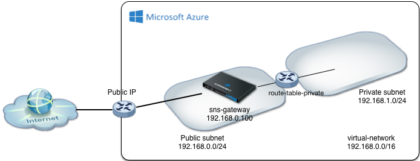

# Stormshield Network Security Simple template

This Azure Resource Manager template deploys a SNS VM and configure a DMZ subnet.

* The virtual network as a public subnet facing Internet and a private subnet
* A route table is created to route trafic from the private network through the SNS appliance

## Next configuration steps:

* Setup Filtering and NAT masquerading for the Private subnet on the SNS appliance
* Deploy servers in the private subnet